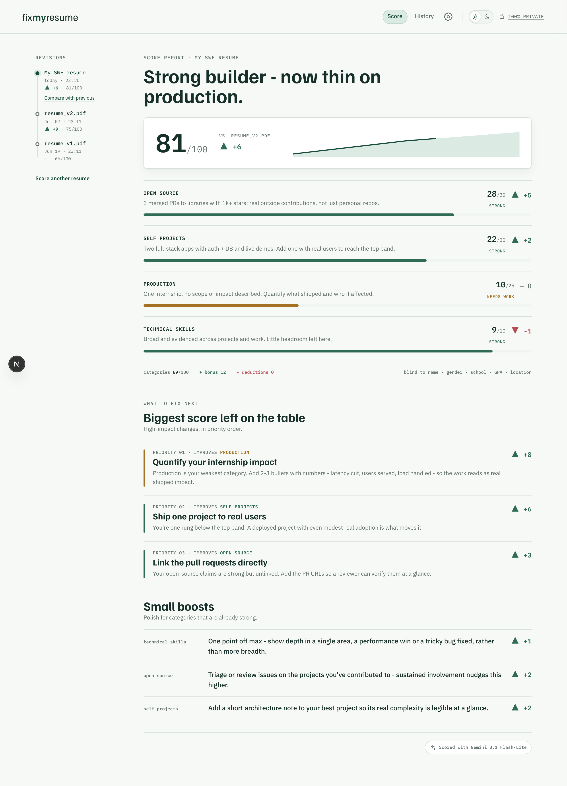
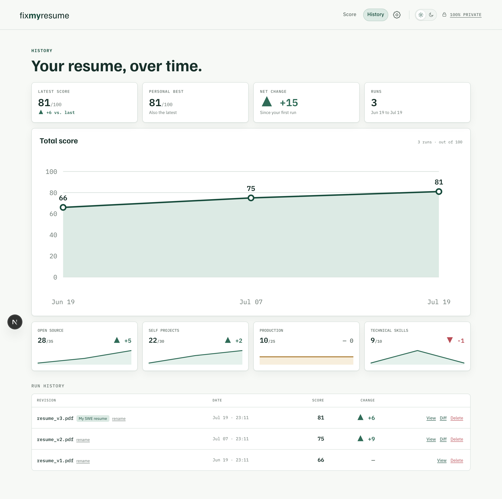
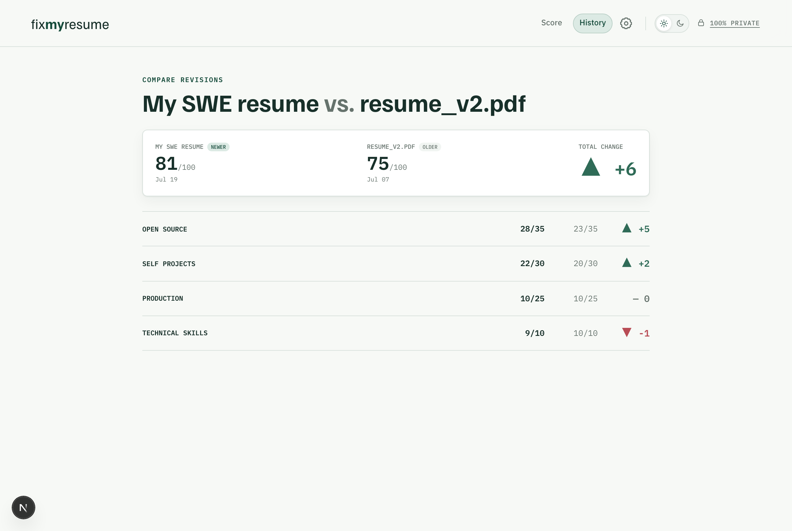
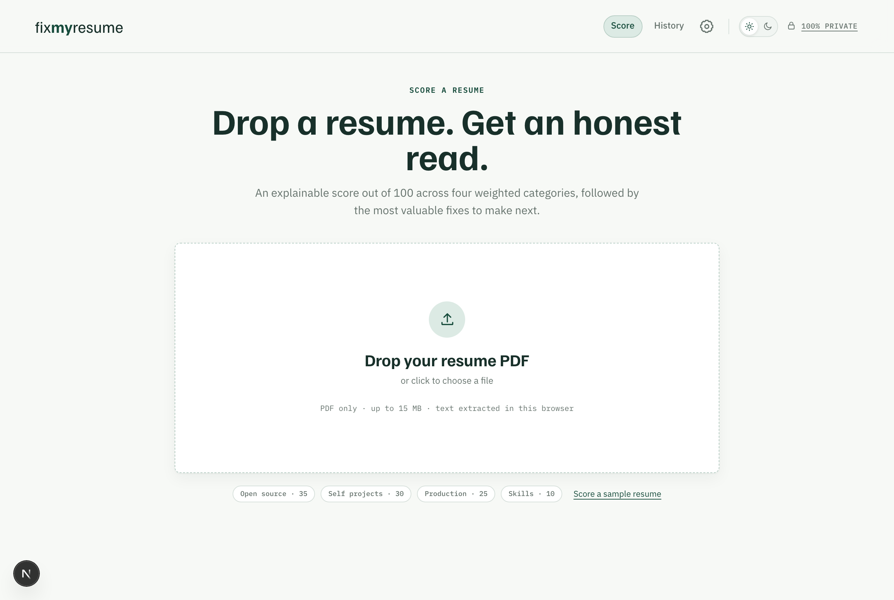
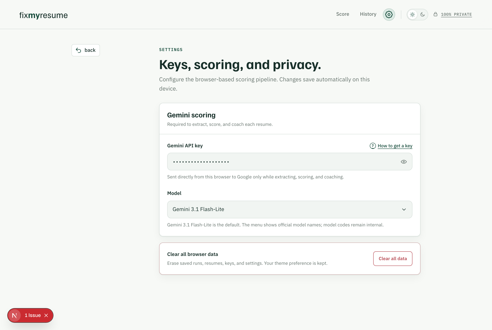
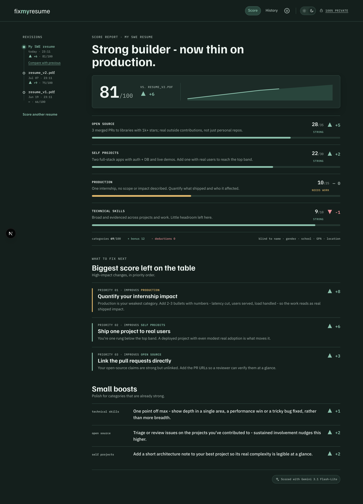

# Fix My Resume

<p align="center"><strong>A privacy-first, in-browser resume scorer.</strong><br>
Upload a resume PDF and get an explainable, fairness-constrained score, a plain-language coach, and trend tracking over time — running entirely in your browser.</p>

<p align="center">
  <a href="https://fixmyresume.dev"></a>
  <a href="./LICENSE"></a>
  
  
</p>

> **🔗 Try it now: https://fixmyresume.dev** — no install, no sign-up. Bring your own Google Gemini API key.
>
> 🔒 Your PDF is read locally. Extracted resume text and your API key go directly from your browser to Google Gemini, never through a server operated by this project.

---

<p align="center">
  
</p>

## Why this exists

Most resume scorers ask you to upload your career history to their servers, or they're command-line tools you have to install and babysit. **Fix My Resume** is neither — a polished web app anyone can open and use that runs the whole pipeline **in your browser**: it parses your PDF, produces an explainable score, coaches you on what to fix, and charts your progress over time. Visual trends, a conversational coach, and run-to-run comparison, with privacy built into the architecture rather than promised in a policy.

The guiding constraint is **privacy by architecture**. The app is a **static site with no backend of ours**. Your PDF is parsed in the browser; scoring goes **straight from your browser to Google Gemini using a key you supply**. Your resume, your key, and your entire history never touch a server we control — there's nothing to leak, log, or breach.

---

## What it does, and why it helps

### 🔒 100% private — by design, not by promise
The app runs client-side. PDF text extraction happens locally via `pdf.js`; scoring requests go directly from your browser to Google Gemini. When a resume includes a GitHub profile, public enrichment calls GitHub's API directly. Run history is stored in browser **IndexedDB** and settings use browser storage. **"Clear all data"** removes the app's saved runs, keys, and settings from that browser.
**Why it matters:** a resume is sensitive. This is the rare scoring tool you can use without handing your career history (or an API key) to a third party.

### 📊 An explainable, fairness-constrained score
Each run produces a **/100 score across four weighted categories** — Open Source (35), Self-Projects (30), Production (25), Technical Skills (10) — plus bonus points and deductions, with the final score capped at 100. **Every category shows the evidence behind its number.**
**Why it matters:** you don't just get a grade, you get the *reasoning* — and the rubric is explicitly **blind to name, gender, school, GPA, and location**, so the score reflects the work, not the person.

### 🧭 A plain-language resume coach
A dedicated pass turns the score into action: **"Biggest score left on the table"** lists the highest-impact fixes in priority order (each tagged with the category it boosts and an estimated point gain), followed by **"Small boosts"** for categories that are already strong.
**Why it matters:** most tools tell you *what* you scored; this tells you *what to do next* and roughly how much each change is worth.

### 📈 Trend tracking — watch your resume improve
Re-score an improved resume and the app charts your **total over time**, draws **per-category sparklines**, and summarizes **latest / personal best / net change** at a glance.
**Why it matters:** iterating on a resume is usually guesswork. Here it's measurable — you can see whether an edit actually moved the needle.

### 🔀 Run-to-run diff
Pick any two runs and see the **category-by-category delta** (`▲ +5` / `▼ -1`). A commit-log-style "revision rail" tracks every past version of your resume.
**Why it matters:** it turns resume editing into something like version control — concrete deltas instead of vague impressions.

### 🐙 Automatic GitHub enrichment
When a resume includes a GitHub profile, the scorer automatically factors in **public contributions** — repositories, open-source vs. personal projects, stars, and contributor activity. No GitHub token is required.
**Why it matters:** for engineers, real code is the strongest signal. This grounds the score in what you've actually shipped.

### 🎨 Considered, accessible design
Light and dark themes, a typographic "human document measured by a precise machine" aesthetic, keyboard-navigable, screen-reader-friendly (live-region progress, `aria-current` nav), and `prefers-reduced-motion` aware.

---

## Choosing a Gemini model

You bring your own Gemini key, so **you choose the model** from the dropdown in **Settings → *Model*** (it defaults to Gemini 3.1 Flash-Lite). Every run makes **3 Gemini calls** — profile extraction → scoring → coaching. When a GitHub profile is found, the browser also requests its public data directly from GitHub. All Gemini calls use structured JSON output, which every model below supports.

| Display name | Model code | Default |
|---|---|:---:|
| Gemini 3 Flash Preview | `gemini-3-flash-preview` | |
| Gemini 3.1 Flash-Lite | `gemini-3.1-flash-lite` | Yes |
| Gemini 3.1 Pro Preview | `gemini-3.1-pro-preview` | |
| Gemini 3.5 Flash | `gemini-3.5-flash` | |

> **A note on scores:** scores are **indicative**. Fix My Resume runs its scoring pipeline in TypeScript with a single combined extraction step, so a number here may differ from a reference run. Use it for relative guidance and trend tracking, not as an absolute hiring signal.

---

## Screenshots

| History & Trends | Compare revisions |
|---|---|
|  |  |

| Score (upload) | Settings | Dark mode |
|---|---|---|
|  |  |  |

---

## Quick start

**Just use it:** open **https://fixmyresume.dev**, go to **Settings**, paste your [Gemini API key](https://aistudio.google.com/apikey), then drop a resume PDF on the **Score** screen.

**Run it locally:**

```bash
git clone https://github.com/1akashkalita/fix-my-resume.git
cd fix-my-resume/web
npm install
npm run dev          # http://localhost:3000
```

Full development, testing, and deployment docs are in **[`web/README.md`](web/README.md)**.

### How it works (per run, all in your browser)

1. **PDF → text** — `pdf.js` extracts selectable text locally.
2. **Profile extraction** — Gemini locates profile links in the resume.
3. **GitHub enrichment** — when a GitHub profile is present, its public repositories and contributor activity are fetched automatically.
4. **Scoring** — Gemini returns the fairness-constrained `/100` evaluation using the available evidence.
5. **Coaching** — a final Gemini call produces the prioritized fixes and boosts.

Uploaded-resume results are saved to IndexedDB so trends and diffs can be computed across runs. The bundled sample is kept only for the current tab and is not added to History.

---

## Credits

The scoring methodology — the weighted category rubric and its fairness constraints — is adapted from the open-source [**Hiring Agent**](https://github.com/interviewstreet/hiring-agent) project and reimplemented in TypeScript for the browser. Everything else here — the web app, its UI, trends, coach, run-to-run diffs, and fully client-side architecture — is original to Fix My Resume.

---

## License

[MIT](./LICENSE).
